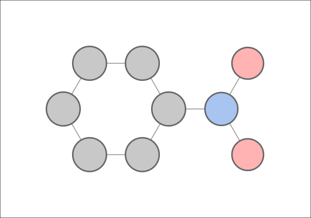

# Make Molecular Graph — Inkscape Plugin

Generates a stylized molecular graph SVG from a SMILES string.
Atoms are drawn as circles using a pastel CPK color scheme; bonds are gray lines.
Double and triple bond orders are rendered as parallel lines.
Hydrogens are hidden by default.



*Nitrobenzene (`c1ccccc1[N+](=O)[O-]`) with default settings — single-line bonds,
no labels, pastel CPK colors (gray = C, blue = N, red = O).*

---

## How it works

Inkscape runs extensions with its **own bundled Python** (inside `Inkscape.app`),
which only provides `inkex`. To access RDKit for SMILES parsing and 2D coordinate
generation, the plugin calls a **second Python interpreter via subprocess** and
reads the result back as JSON.

```
Inkscape's Python  →  make_mol_graph.py  →  subprocess call
                                                    ↓
                       .pixi/envs/default/bin/python  (has rdkit)
                                                    ↓
                                   JSON: atoms + bonds → draw SVG
```

The pixi environment lives **alongside the plugin files** and is deployed together
with them. No global install of RDKit is required.

---

## Setup (first time)

[Install pixi](https://prefix.dev/docs/pixi/overview) if you haven't already:

```sh
curl -fsSL https://pixi.sh/install.sh | bash
```

Then install the environment from the plugin's project directory:

```sh
cd /path/to/inkscape_plugins/make_mol_graph
pixi install
```

This creates `.pixi/envs/default/` with Python + RDKit inside it.

---

## Deploying to Inkscape

Copy the plugin files **and the entire `.pixi/` directory** to Inkscape's
extensions folder:

```sh
INKSCAPE_EXT="/Applications/Inkscape.app/Contents/Resources/share/inkscape/extensions"

cp make_mol_graph.py make_mol_graph.inx "$INKSCAPE_EXT/"
cp -r .pixi "$INKSCAPE_EXT/"
```

The plugin auto-detects the pixi Python by looking for:

```
{extensions_folder}/.pixi/envs/default/bin/python   # macOS / Linux
{extensions_folder}/.pixi/envs/default/python.exe   # Windows
```

If neither is found it falls back to the system `python3` — which will fail
unless RDKit happens to be installed there.

> **Note:** The `.pixi/` directory is shared across any plugins that use it.
> If you deploy multiple pixi-backed plugins, they will share the same
> environment as long as their dependencies are compatible.

---

## Usage

1. Restart Inkscape after deploying.
2. Go to **Extensions → Generate → Make Molecular Graph**.
3. Enter a SMILES string (default: nitrobenzene `c1ccccc1[N+](=O)[O-]`).
4. Adjust style parameters and click **Apply**.

### Parameters

| Tab | Parameter | Default | Description |
|-----|-----------|---------|-------------|
| Molecule | SMILES | `c1ccccc1[N+](=O)[O-]` | Any valid SMILES string |
| Molecule | Show Hydrogens | off | Add explicit H atoms |
| Molecule | Show Atom Labels | on | Draw element symbols |
| Molecule | Show Carbon Labels | off | Label C atoms (usually omitted in chemistry) |
| Style | Scale | 50 | px per RDKit coordinate unit (~1.5 Å per bond) |
| Style | Atom Radius | 12 px | Base circle size (scaled per element) |
| Style | Bond Width | 1.0 px | Line thickness — matches the neural network plugin default |
| Style | Double-Bond Spacing | 4 px | Gap between parallel lines for double/triple bonds |
| Advanced | Python Path | *(blank)* | Override the auto-detected interpreter path |

### Atom colors (pastel CPK)

| Element | Color |
|---------|-------|
| H | near-white `#F0F0F0` |
| C | light gray `#C8C8C8` |
| N | pastel blue `#A8C4F0` |
| O | pastel red `#FFB3B3` |
| F | pastel green `#AAEEBB` |
| Cl | pastel green `#AADDAA` |
| Br | pastel brown `#DEB8A0` |
| I | pastel purple `#D4A4D4` |
| S | pastel yellow `#FFFAA0` |
| P | pastel orange `#FFD8A0` |

---

## Troubleshooting

**"RDKit helper produced no output"**
Run `pixi install` in the plugin's project directory, then redeploy `.pixi/`.

**"Python interpreter not found"**
The auto-detection path didn't find `.pixi/envs/default/bin/python`.
Check that `cp -r .pixi "$INKSCAPE_EXT/"` ran successfully, or set the
Python Path manually on the Advanced tab.

**"Could not parse SMILES"**
Verify your SMILES string is valid — try it at https://www.cheminfo.org or
in RDKit directly with `Chem.MolFromSmiles(smiles)`.
